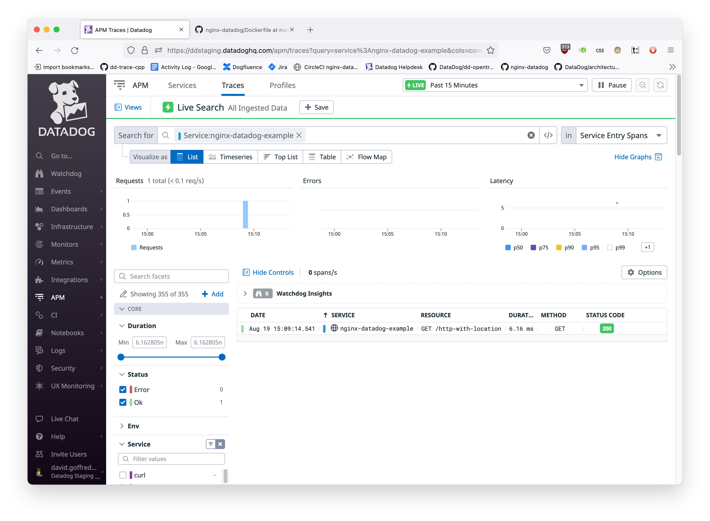
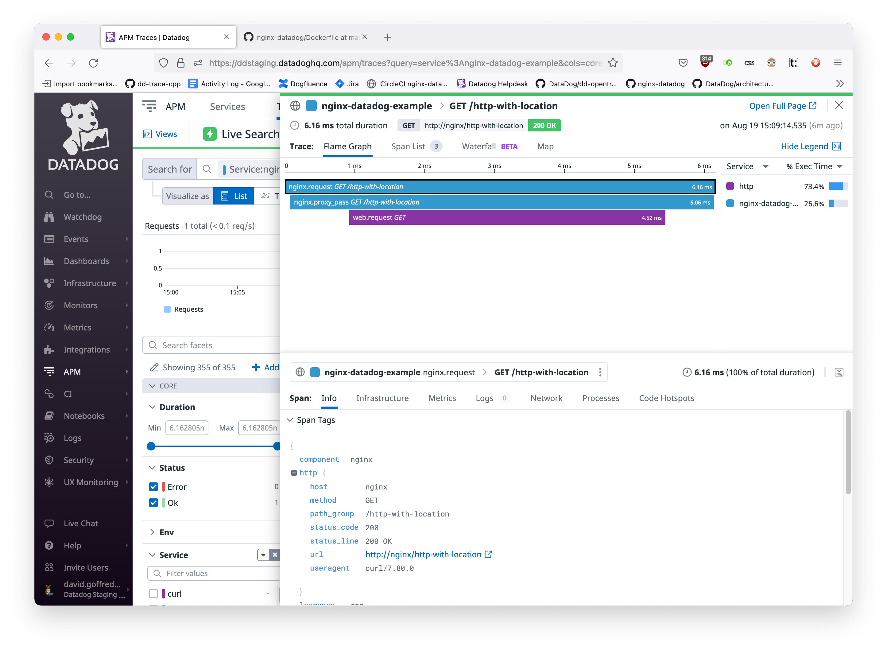

Example System
==============
This is an example of how the Datadog module adds tracing to Nginx.

This directory is a [docker-compose][3] setup containing the following
services:
- `nginx` runs an instance of Nginx that:
    - accepts HTTP on port 80,
    - accepts gRPC on port 1337,
    - serves as a reverse proxy for the `http`, `fastcgi`, and `grpc` services, and
    - is configured by [services/nginx/nginx.conf](services/nginx/nginx.conf).
- `http` runs a NodeJS HTTP server that listens on port 8080.
- `fastcgi` runs a NodeJS FastCGI server that listens on port 8080.
- `grpc` runs a NodeJS gRPC server that listens on port 1337.
- `client` contains the command line tools `curl` and `grpcurl`.

Because client command line tools are available within the `client` service,
this example requires only `docker-compose` and a working Docker environment as
dependencies.

Usage
-----
Bring up the services by setting a Datadog API key and invoking the
[bin/run](bin/run) wrapper script:
```shell
$ export DD_API_KEY=your_api_key_here
$ bin/run
```
Then, in another shell, make HTTP or gRPC calls to the `nginx` service using
the included command line tools:
```shell
$ bin/curl http://nginx/http-with-location
{
  "service": "http",
  "headers": {
    "x-datadog-trace-id": "419118807587123376",
    "x-datadog-parent-id": "2309657734313287178",
    "x-datadog-sampling-priority": "1",
    "host": "http:8080",
    "connection": "close",
    "user-agent": "curl/7.80.0",
    "accept": "*/*"
  }
}
$
```
See [services/nginx/nginx.conf](services/nginx/nginx.conf) for the available routes.

Traces will appear in the Datadog UI with the configured service name, which in this example is `nginx-datadog-example`:





Nginx Version
-------------
The Nginx version and target system can be specified by setting the
`NGINX_IMAGE_TAG` environment variable.  The value of the environment variable
is the tag of the corresponding [nginx Docker image][1], without the "nginx:"
prefix.

For example, the default value for `NGINX_IMAGE_TAG` in this example is `1.23.1`, which indicates compatibility with Nginx 1.23.1 running on Debian, as per [nginx:1.23.1][2].

Setting `NGINX_IMAGE_TAG` to `1.23.1-alpine` would indicate compatibility with Nginx 1.23.1 running on Alpine, as per [nginx:1.23.1-alpine][3].

Command Line Tools
------------------
[bin/](bin/) contains the following scripts:
- [bin/run](bin/run) is a wrapper around `docker-compose up`.
- [bin/curl](bin/curl) executes `curl` inside the `client` service.  This way,
  `curl` has access to the network internal to `docker-compose`.  For example,
  `bin/curl http://nginx` sends a request to the `nginx` service, because that
  service is known by the host name "nginx" within `docker-compose`.
- [bin/grpcurl](bin/grpcurl) executes `grpcurl` in plaintext mode within the
  `client` service.  It exists for the same reason as `bin/curl`.  For example,
  `bin/grpcurl nginx:1337 upstream.Upstream.GetMetadata` requests gRPC service
  metadata from the `nginx` service listening on port 1337.

[1]: https://hub.docker.com/_/nginx/
[2]: https://hub.docker.com/layers/nginx/library/nginx/1.23.1/images/sha256-f26fbadb0acab4a21ecb4e337a326907e61fbec36c9a9b52e725669d99ed1261?context=explore
[3]: https://hub.docker.com/layers/nginx/library/nginx/1.23.1-alpine/images/sha256-2959a35e1b1e61e2419c01e0e457f75497e02d039360a658b66ff2d4caab19c4?context=explore
[4]: https://docs.docker.com/compose/
